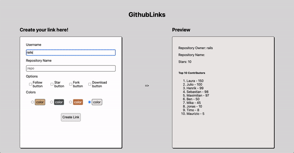

## GithubLinks

##### GithubLinks is an app that allows you to create links of a specific github repository. This way you can create sharable links so people can interact easily with a repository

## GithbLinks Demo

#### If you want to visit the demo app open the next link:
[GithubLinks](https://superchat-frontend-challenge-nine.vercel.app/)

### Features

##### User Stories

1. As a new user, I want to be able to insert a username and a repository name and get a link to interact with the repository.
2. As a user, I want to be able to chose the color of the repository card.
3. As a user, I want to be able to chose the action buttons to interact with the repository.
4. As a user, I want to be able to copy the repository link to share it.
5. As a user, I want to be able to navigate to the repository link and interact with the card 

##### Technical

1. The app is written in React with Typescript.
2. The app is developed using NextJS.
3. The app is styled using just css (css modules).
4. The information was stored in firebase.

### Do you want to experiment with this project?

###### Clone this repository using: git clone https://github.com/jjla26/superchat-frontend-challenge.git. After cloning the repository run: `npm install` or `yarn add` to install all the dependencies and is ready to be used running: `npm run dev` or `yarn dev`.

###### The project is using firebase to store the repository links and data. Therefore, to make it work you will have to create a firebase project and initialize a firestore database.

###### Finally, you must go to the project configuration and find the SDK Configuration. You must copy the configuration code of your Firebase service into the firebase file in the root of the app directory. The configuration code in both Firebase and the app looks something like this:

`var firebaseConfig = {
  apiKey: "",
  authDomain: "",
  projectId: "",
  storageBucket: "",
  messagingSenderId: "",
  appId: "",
  measurementId: ""
};`

##### Remember to replace the values for the ones in your firebase project